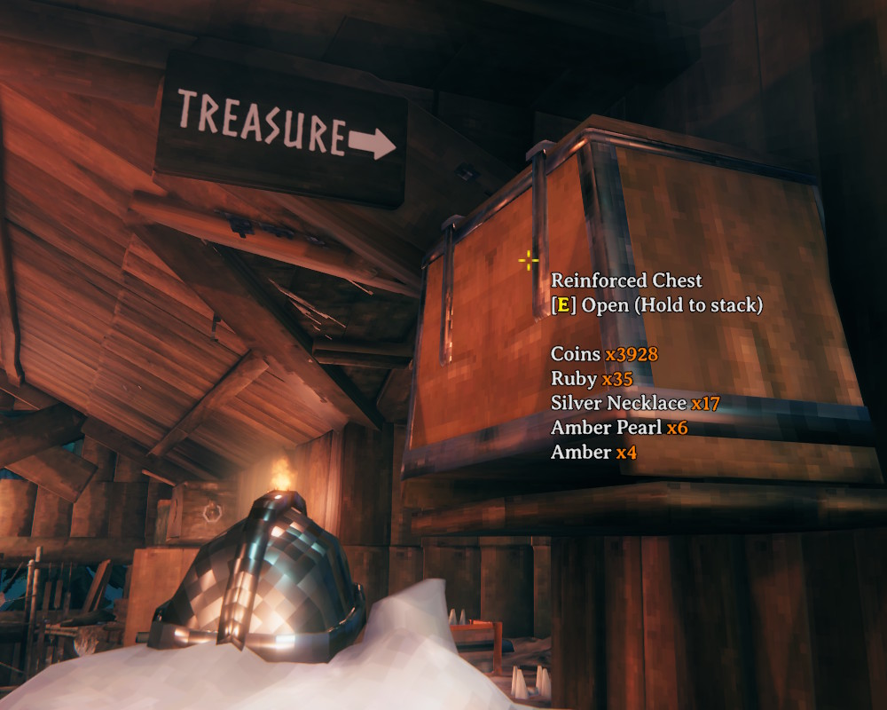

# Chest Peek

Hover over a chest to see what's inside without opening it.

- Lists the contents below the normal hover text, with stacks of the same item added together
- Sorted by count, largest first, showing up to 12 lines
- Respects wards - chests you don't have access to stay hidden

## Installation

1. Install [BepInExPack for Valheim](https://thunderstore.io/c/valheim/p/denikson/BepInExPack_Valheim/)
2. Extract the zip into your Valheim folder, or copy `ChestPeek.dll` into `BepInEx\plugins`

Client-side only - other players and the server don't need it.
