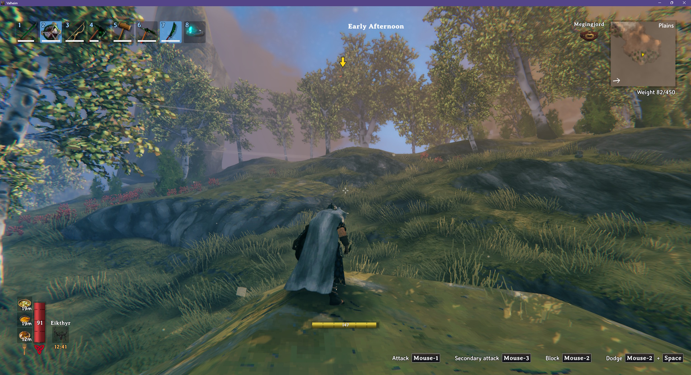
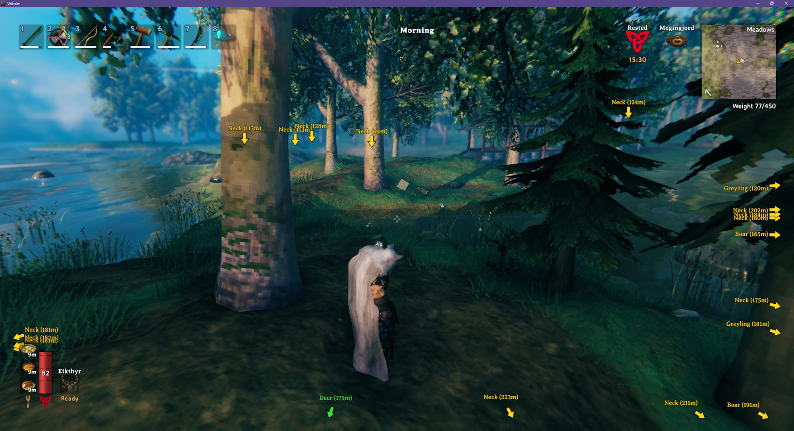

# Creature Marker

Puts a colored arrow above nearby creatures. Creatures that are off-screen get an arrow pinned to the edge of the screen, pointing toward them.

- Separate colors for passive creatures, hostile creatures and bosses
- Optional name and distance label on each marker
- A matching colored dot on the minimap and the large map for each marked creature
- Choose which creatures are marked - all of them, only hostile ones, or creature by creature
- Includes creatures added by other mods

## Configuration

`BepInEx\config\kriona.CreatureMarker.cfg` is created when you first load a world with the mod, and changes take effect as soon as the file is saved. You do not need to restart Valheim or rejoin the world.

| Setting | Default | Description |
| --- | --- | --- |
| Show On Screen | true | Shows an arrow above each marked creature, pinned to the screen edge when it is off-screen |
| Show On Map | true | Shows a dot on the minimap and the large map for each marked creature, except while you are in a dungeon |
| Max Distance | 50 | How far away, in meters, a creature can be and still get a marker (5 - 500) |
| Show Name | false | Shows the creature's name with its marker |
| Show Distance | false | Shows the creature's distance with its marker |
| Passive Color | #40D940 | Marker color for creatures that won't attack you |
| Hostile Color | #FFD91A | Marker color for creatures that will |
| Boss Color | #FF3333 | Marker color for bosses |
| All Creatures | false | Marks every creature |
| All Hostile Creatures | true | Marks every creature that will attack you |

Every creature also gets its own line, `Prefab = inherit/true/false ## Name`. `inherit` follows the All switches, while `true` or `false` always shows or hides that creature's marker.

Colors can be `#RRGGBB` or a color name like `red`, `yellow`, `green`, `cyan` or `magenta`.

## Screenshots

### An arrow appearing above a Deathsquito

### Showing names and distances

## Installation

1. Install [BepInExPack for Valheim](https://www.nexusmods.com/valheim/mods/3605)
2. Extract the zip into your Valheim folder, or copy `CreatureMarker.dll` into `BepInEx\plugins`

Client-side only - other players and the server don't need it.
