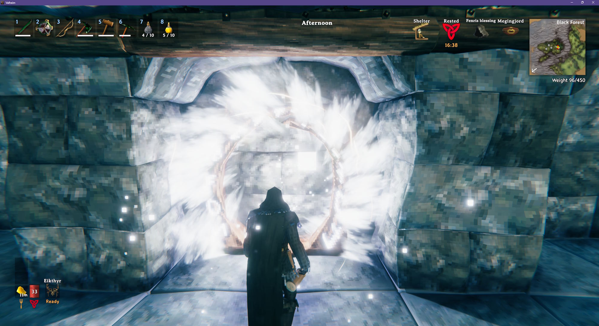
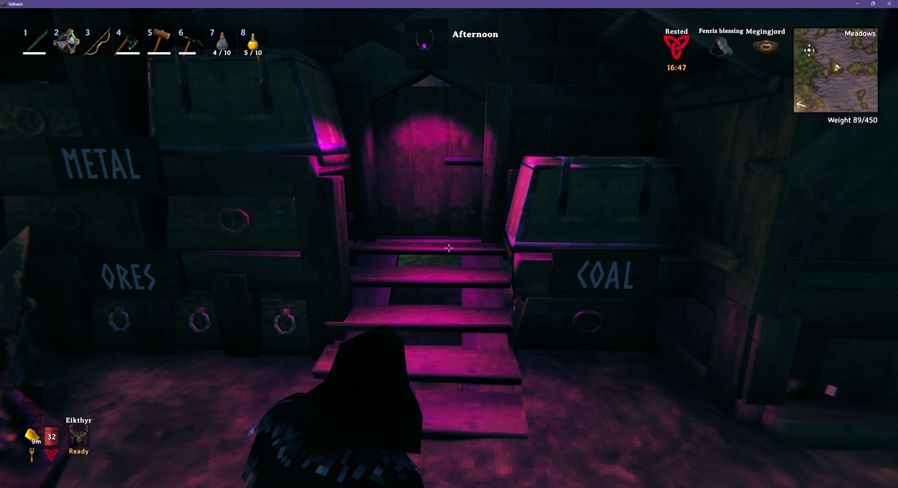
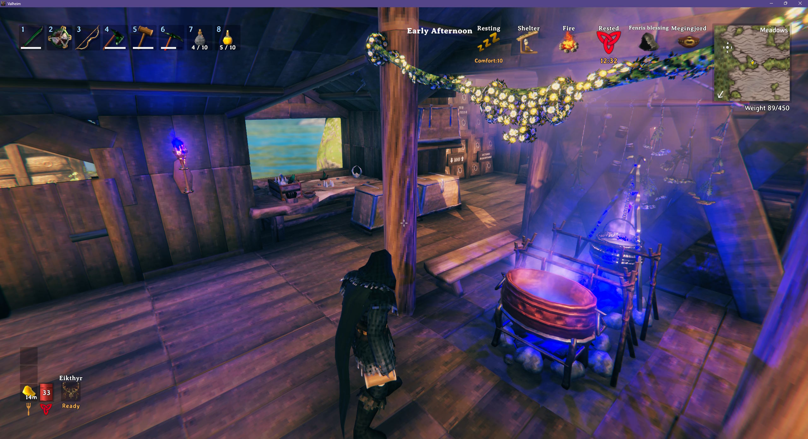
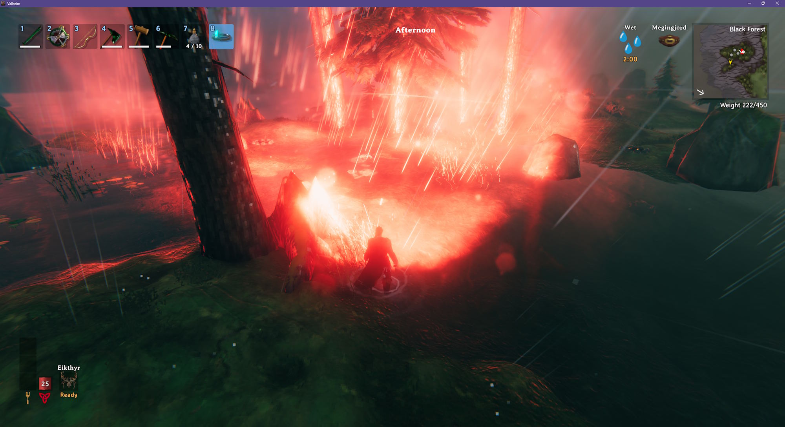
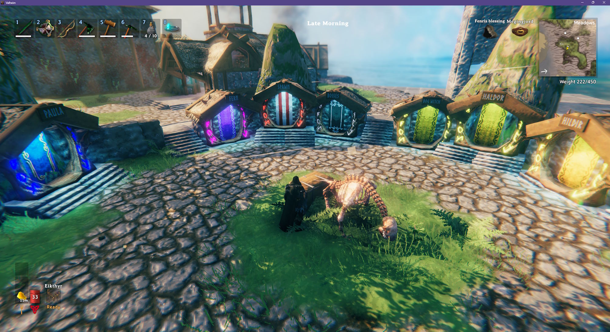
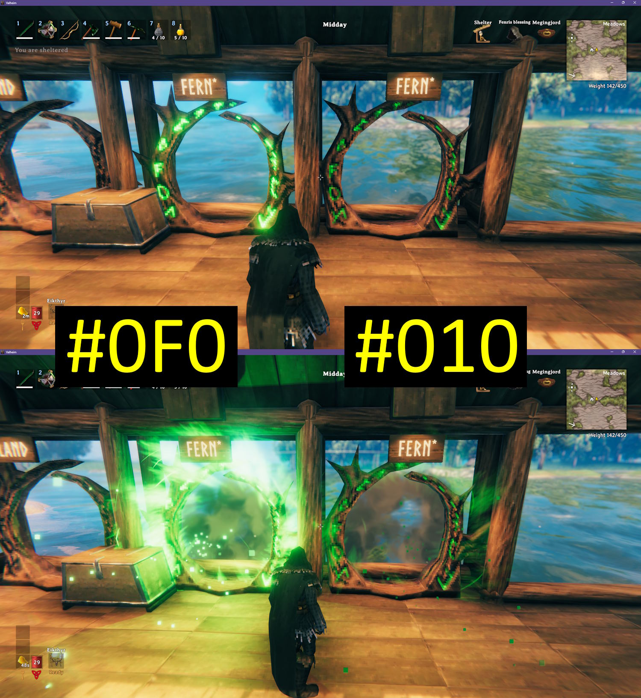
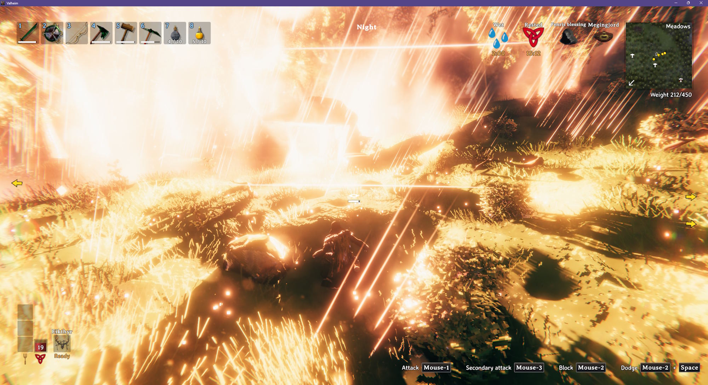

# Light Color

Hover over an object that gives off light (e.g., sconce, campfire, portal) and press L to enter a color for its light, brightness, and range.

- Type a color name like `red`, `orange`, `yellow`, `lime`, `cyan`, `blue`, `purple` or `magenta`, or a hex color like `#0F0` or `#002B49`
- Add a brightness and range after the color, like `blue 150% 20m` - see [Brightness and Range](#brightness-and-range)
- Works on item stands too - the color applies to the mounted Dverger circlet, torch or anything else that glows, and the color stays with the stand when you swap the item
- Set the `Helmet` setting to color the Dverger circlet you're wearing - see [Configuration](#configuration)
- Type `default` or blank to go revert to the original color
- The hover text shows the key on every object it works with
- Respects wards - you can't change lights inside a ward you don't have access to

## Multiplayer Servers

An object's color / brightness / range is stored on the object and saved with the world. The server does not need this mod installed in order to save the color.

Colors are shared with everyone who uses this mod, and changes are seen by all players.

The `Helmet` setting is copied to your character; other players with this mod see your Dverger circlet in the color you set.

## Screenshots

### A mounted purple Dverger circlet

### Blue campfires and sconce

### Cosplaying as Cyclops from the X-Men

The `Helmet` setting set to `#F00 500% 50m`.

### Portal hub with multiple colors

## Color Brightness

The game treats black as "no light". If you set an object's color to black, it does not emit light. `#111` (dark gray) emits very little light, while `#FFF` (white) emits a lot of light.

The left portal is set to `#0F0` (bright green) while the right portal is set to `#010` (dark green).

## Brightness and Range

Add a brightness ending in `%` or a range ending in `m` after the color. Both are optional, and work without a color too:

- `blue 150%` - blue, and one and a half times as bright
- `blue 150% 20m` - blue, brighter, and lights up 20 meters around it
- `50%` - the object's original color at half brightness
- `0%` - turns the light off, while the flame or glow stays

Brightness can be from 0% to 500%, and range from 1m to 50m. The range sets the size of the object's largest light, and its other lights are scaled to match, so a fire that runs low on fuel still shrinks. Flames and glowing parts only change color - their size stays the same.

Bigger lights light up more of the world around them, which costs more performance when there are a lot of them.

A campfire set to 500% brightness and a 50m range.

## Default Colors

`default` or blank reverts an object to its original color. Fires that burn low when they run out of fuel switch to a smaller, dimmer light. Objects with more than one light have one of each color listed - the color you type is used for all of them.

| Object | Light color | Low on fuel |
| --- | --- | --- |
| Artisan Table | `#87DCFF` | |
| Battering Ram | `#FF7A00` | |
| Black Forge | `#FF7B99`, `#FF9E7B` | |
| Blast Furnace | `#FFA400` | |
| Blue Standing Brazier | `#7BC5FF` | `#BFFEFF` |
| Bonfire | `#FF8153` | `#FF8153` |
| Campfire | `#FF8153` | `#D68669` |
| Cauldron | `#FFAC53` | |
| Charcoal Kiln | `#FF7A00` | |
| Drakkar | `#F4C7AE` | |
| Dverger Circlet on an item stand | `#A0F8EE` | |
| Dverger Pole Lantern | `#FFC849` | |
| Dverger Wall Lantern | `#FFC849` | |
| Eitr Refinery | `#53E1FF`, `#FF53C6`, `#FF7B99` | |
| Eternal Pyre | `#FF7400` | |
| Fey Lights | `#8DB8FF` | |
| Forge | `#FF9E7B` | |
| Frigid Kiln | `#77D9FF` | |
| Frost Foundry | `#52E4FF` | |
| Galdr Table | `#FF31DC` | |
| Hanging Brazier | `#FF9E7B` | `#D68669` |
| Hearth | `#FF9E7B` | `#D68669` |
| Hooded Lantern | `#FFECC2` | |
| Hot Tub | `#FF8153` | |
| Iron Fire Pit | `#FF8153` | `#D68669` |
| Jack-o-turnip | `#FF9E7B` | |
| Lava Lantern | `#FF9E7B` | |
| Longship | `#F4C7AE` | |
| Mead Ketill | `#FFAC53` | |
| Portal | `#FF6400` | |
| Resin Candle | `#FFA539` | |
| Sap Extractor | `#ADFF5D` | |
| Sconce | `#FF9E7B` | |
| Shield Generator | `#FFAF8B` | |
| Smelter | `#FFA400`, `#FF8400` | |
| Snow Lantern | `#FFA539` | |
| Standing Blue-burning Iron Torch | `#7BC5FF` | |
| Standing Brazier | `#FF9E7B` | `#D68669` |
| Standing Green-burning Iron Torch | `#A1FF7B` | |
| Standing Iron Torch | `#FF9E7B` | |
| Standing Wood Torch | `#FF9E7B` | |
| Stone Oven | `#FF8153` | |
| Stone Portal | `#FF0E00` | |
| Unfading Candles | `#FF31DC` | |
| Ward | `#FCDFC1` | |
| Wisp Fountain | `#CB00FF` | |
| Wisp Torch | `#7BC8FF` | |
| Yule Tree | `#FFAD31` | |

Typing one of these colors instead of `default` or blank gets you the same light, but the flame comes out paler than the original.

## Configuration

`BepInEx\config\kriona.LightColor.cfg` is created on first run, and changes are read each time you join a world. You do not need to restart Valheim.

- `ColorKey` - the key to press while looking at a light, optionally with modifiers, e.g. `L` or `LeftControl + L` (default `L`)
- `Helmet` - the color, brightness and range for the light on your equipped Dverger circlet. Seen by other players with this mod (default blank, which keeps the circlet's own light)

## Installation

1. Install [BepInExPack for Valheim](https://www.nexusmods.com/valheim/mods/3605)
2. Extract the zip into your Valheim folder, or copy `LightColor.dll` into `BepInEx\plugins`

Client-side only - the server doesn't need it. Other players only need it to see the colors.
