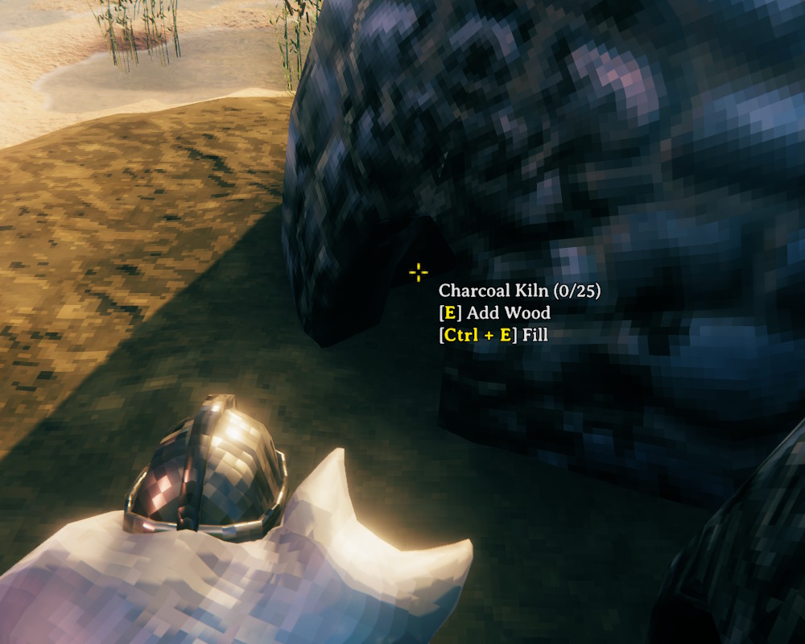

# Quick Fill

Hold Shift and press the use key (E) to fill a station in one go instead of adding items one at a time.

- Smelters, kilns, blast furnaces, refineries, etc. - fills ore and fuel
- Ovens - fills fuel
- Campfires, bonfires, hearths, torches, etc. - fills fuel without turning the fire off
- The hover text shows the shortcut on everything it works with

## Configuration

`BepInEx\config\kriona.QuickFill.cfg` is created on first run:

- `ModifierKey` - the key to hold while pressing the use key, e.g. `LeftControl` or `LeftAlt` - either side of Ctrl, Shift and Alt counts, and `None` turns the fill off (default `LeftShift`)

## Installation

1. Install [BepInExPack for Valheim](https://www.nexusmods.com/valheim/mods/3605)
2. Extract the zip into your Valheim folder, or copy `QuickFill.dll` into `BepInEx\plugins`

Client-side only - other players and the server don't need it.
