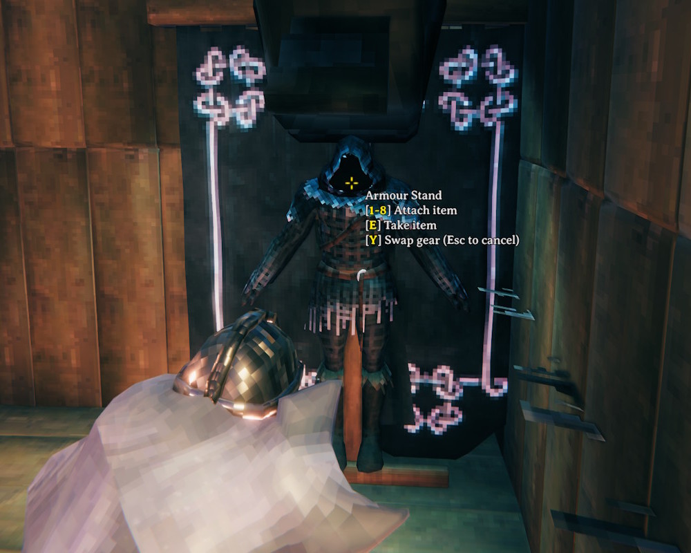

# Swap Gear

Look at an armor stand and press Y to swap what you're wearing with what's on the stand.

- Only the slots the stand has items in are swapped - your helmet goes on the stand in place of its helmet, your sword in place of its sword, and so on
- The stand's items drop and are picked up automatically, then equipped as they land in your inventory
- Unequipping and equipping take as long as they do from the inventory, unless `InstantEquip` is turned on
- The hover text shows the key on any armor stand with items on it
- Press Esc to stop a swap partway through
- Respects wards - stands you don't have access to can't be swapped with

## Configuration

`BepInEx\config\kriona.SwapGear.cfg` is created on first run:

- `SwapKey` - the key that starts a swap, optionally with modifiers, e.g. `LeftControl + Y` (default `Y`)
- `PickupTimeout` - seconds to wait for the stand's items to be picked up before giving up on equipping them (default `10`)
- `InstantEquip` - unequip and equip gear instantly instead of taking the usual time (default `false`)

## Installation

1. Install [BepInExPack for Valheim](https://thunderstore.io/c/valheim/p/denikson/BepInExPack_Valheim/)
2. Extract the zip into your Valheim folder, or copy `SwapGear.dll` into `BepInEx\plugins`

Client-side only - other players and the server don't need it.
