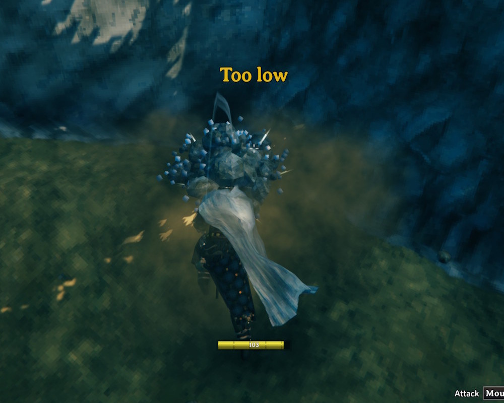

# Too Low

Shows a brief "Too low" message when your pickaxe hits ground that is already at the game's 8m digging limit, so you know to stop swinging.

- The message fades out quickly and clears as soon as you swing again
- Stays silent when the dig is blocked by a ward or a no-build area

## Installation

1. Install [BepInExPack for Valheim](https://thunderstore.io/c/valheim/p/denikson/BepInExPack_Valheim/)
2. Extract the zip into your Valheim folder, or copy `TooLow.dll` into `BepInEx\plugins`

Client-side only - other players and the server don't need it.
