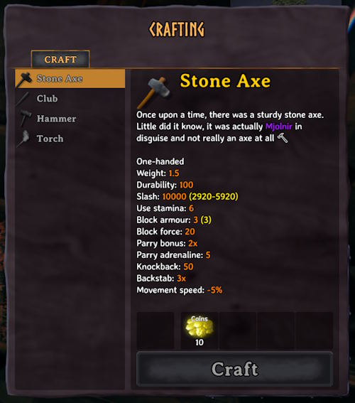

# Tweak Stats

Change the stats of any item, recipe, creature, build piece or status effect - weapon damage, attack stamina, armor, block power, food, durability, weight, stack sizes, crafting costs, creature health and drops, building health and more.

- Set a stat to a number, add to it or multiply it - `weight = 5`, `weight = +5` or `weight = 1.5x`
- Change one item, several items, every item matching a name like `Sword*` or `*Bow*`, or every item of a skill (e.g., `[Skill:Axes]`) or type (e.g., `[Type:Shield]`)
- Limit tweaks to certain worlds, e.g. single player (`[Worlds: SinglePlayer][/Worlds]`) or a specific multiplayer server (e.g., `[Worlds: Midgard][/Worlds]`)
- Changes take effect as soon as the config file is saved - there's no need to restart Valheim or rejoin the world
- Works with items, recipes, creatures and build pieces added by other mods

Ex: crafting a stone axe that does 10,000 damage, using coins:



## Documentation

### NAMES.md

[NAMES.md](NAMES.md) - the name of every item, recipe, creature, build piece and status effect, next to its in-game name

### STATS.md

[STATS.md](STATS.md) - every stat you can change, from weapon damage to armor to food to crafting costs, plus the damage types, damage modifiers, skills and item types they use

### Console

The [`tweakstats` console command](#console-commands) - looks up names in game or lists the items you're carrying and writes out every stat an item has

## Examples

```ini
# Every item that uses the Axes skill becomes an insta-kill omni-tool
[Skill:Axes]
damages.slash = 10000
damages.chop = 10000
damages.pickaxe = 10000
```

```ini
# Stone axes are free to craft on your single-player world
[Worlds: SinglePlayer]
[AxeStone]
description = Once upon a time, there was a sturdy stone axe. Little did it know, it was actually <color=purple>Mjolnir</color> in disguise and not really an axe at all 🔨
[Recipe:AxeStone]
resources.Wood = 0
resources.Stone = 0
[/Worlds]
```

```ini
# ZOOOOM (fall damage will probably kill you, but enemies can't)
[ArmorRagsChest]
armor = 1000
movementModifier = 10  # tenfold
```

```ini
# Powerlifter pants
[ArmorRagsLegs]
equipStatusEffect = BeltStrength
[Effect:BeltStrength]
addMaxCarryWeight = 600
```

```ini
# A real menace
[Creature:Greyling]
health = 5000
```

```ini
# Capitalism
[Piece:wood_stepladder]
resources.Wood = 0
resources.Coins = 10
```

```ini
# Clubs do fire damage
[Club]
damages.Blunt = 1
damages.Fire = 10
damagesPerLevel.Blunt = 1
damagesPerLevel.Fire = 20
[Recipe:Club]
resources.BoneFragments.amountPerLevel = 0
```

```ini
# Working remotely
[KnifeWood]
attack.attackRange = 100
```

## Configuration

`BepInEx\config\kriona.TweakStats.cfg` is created on first run with an explanation and examples, all commented out. Remove the `#` from the start of a line to use it.

Each `[section]` names what to change, and each line under it is `stat = value`. Lines starting with `#` are comments and are ignored.

### Sections

| Section | Changes |
| --- | --- |
| `[SwordIron]` | An item, by its prefab name |
| `[SwordIron, AxeIron]` | Multiple items |
| `[Sword*]` | Items whose prefab name matches - `*` matches any text and `?` any one letter |
| `[Skill:Swords]` | Every item that uses a skill - see [Skills](STATS.md#skills) |
| `[Type:Shield]` | Every item of a type - see [Item Types](STATS.md#item-types) |
| `[Recipe:SwordIron]` | The recipe that makes an item - wildcards work here too |
| `[Creature:Troll]` | A creature - its health, speed, resistances, AI, drops and attacks |
| `[Piece:woodwall]` | A build piece - its health, resistances and building cost, and things like a chest's size or a fire's fuel |
| `[Effect:Rested]` | A status effect, from food and meads to set bonuses and burning |

Creature and Piece sections, and Effect sections for effects that land on creatures like `Burning` and `Poison`, only apply in single player, when hosting, or on a server that has Tweak Stats - see [Multiplayer Servers](#multiplayer-servers).

Names ignore case. Items are named by their prefab name, like `SwordIron`, rather than the name shown in game, like "Iron sword". [NAMES.md](NAMES.md) lists every item, recipe, creature, build piece and status effect with its name in game, and the [`tweakstats find`](#console-commands) command looks them up in game.

### Values

| Value | Does |
| --- | --- |
| `5` | Sets the stat to 5 |
| `+5` | Adds 5 |
| `-5` | Subtracts 5 |
| `1.5x` | Multiplies by 1.5 |
| `=-5` | Sets the stat to -5 - a negative number needs `=` in front, or it subtracts |

Stats that are whole numbers, like `maxStackSize`, are rounded after adding or multiplying. Stats that aren't numbers are set:

- `true` or `false`, e.g. `teleportable = true`
- One of a list of choices, e.g. `skillType = Axes` or `damageModifiers.Fire = Resistant`
- The name of an item, status effect or crafting station, e.g. `attackStatusEffect = Burning` or `craftingStation = forge`, or `none` to remove it

### Limits

Extreme values are allowed, but a few are kept inside what the game can handle without freezing, crashing or damaging your save. A value outside a limit is changed to the nearest value inside it (and logged).

| Stat | Limit | Why |
| --- | --- | --- |
| Any number | -1,000,000,000 to 1,000,000,000 | Larger numbers overflow the game's math |
| `maxStackSize` | 1 to 65,535 | The game can't add items to a stack of 0, and saves stack sizes as numbers up to 65,535 |
| `amount` on a recipe | 0 to 1,000 | The game makes each crafted stack separately, all at once |
| `attack.projectiles` | 0 to 100 | The game makes every projectile of a shot at once |
| `attack.attackAngle` | -360 to 360 | The game checks for hits every 4 degrees of a swing |
| `width`, `height` on a chest | 1 to 100 | The game makes a slot in the window for each slot in the chest |
| `maxHoney` on a beehive, `maxLevel` on a sap collector | 0 to 1,000 | The game drops each one separately, all at once |

An item's durability is also saved as no more than 21,000,000, the most the game can save.

### Stat Names

A stat's name is the game's name without the `m_`, so `m_attackStamina` is `attackStamina`. Names ignore case.

Example attack and damage stats:

- `attack.attackStamina` - the normal attack's stamina cost
- `attack.attackRange` - the normal attack's reach, in meters
- `damages.slash` - slash damage
- `damages.fire` - fire damage

A group of damage types can be changed all at once - `damages = 1.5x` multiplies slash, fire, chop and every other damage type.

Lists are named by their entries:

- `resources.Iron = 10` - the amount of iron a recipe needs, adding iron when the recipe doesn't use it
- `resources.Iron = 0` - removes iron from the recipe
- `resources.Iron.amountPerLevel = 5` - another stat of the entry
- `damageModifiers.Frost = Resistant` - an armor's frost resistance, adding it when the armor doesn't have one

A misspelled name is reported in the log with suggestions, e.g. `there's no stat "damage" - did you mean damages?`

### Order

Every section that names an item applies to it, from the top of the file down, so a broad section followed by a specific one combines them:

```ini
[Skill:Swords]
damages = 1.2x

[SwordIron]
damages.slash = +10   # The Iron sword gets 1.2x, then +10 slash
```

### Worlds

Sections between `[Worlds: ...]` and `[/Worlds]` only apply on those worlds:

```ini
[Worlds: SinglePlayer, Midgard]
[Skill:Pickaxes]
damages.pickaxe = 2x
[/Worlds]
```

- A world is named by its name, or by its ID when several share a name - a dedicated server's world is often just `Dedicated`
- A server can be named by the address you join it with, with or without the port, e.g. `203.0.113.5`, `203.0.113.5:2456` or `valheim.example.com`. A server joined from the server list is named by its Steam ID, or its PlayFab ID for crossplay servers
- `SinglePlayer` is any world started without letting other players join
- The [`tweakstats world`](#console-commands) command shows the world's name and ID and the server's address or ID for wherever you're playing
- Sections outside a group apply everywhere
- Groups can't be inside each other

### Issues

Lines that can't be used are skipped and logged to `BepInEx\LogOutput.log` with their line number and what's wrong, and the rest of the file still applies. When the file is saved while playing, a message in the top left says how many problems it has.

## Console Commands

Press F5 to open the console.

| Command | Does |
| --- | --- |
| `tweakstats find iron sword` | Lists the items whose name or prefab name contains the text, e.g. `SwordIron - Iron sword` |
| `tweakstats inventory` | Lists the items you're carrying with their section names and main stats - damage, armor, block power, food, durability and weight - including your tweaks and each item's upgrade level, e.g. `[SwordIron] Iron sword - level 2, equipped, damages slash 55, durability 180/250, weight 1.5` |
| `tweakstats world` | Shows the world's name and ID, whether you're playing alone, hosting or on a server - with the server's address, Steam ID or PlayFab ID - and the `[Worlds: ...]` groups that apply to it |
| `tweakstats dump SwordIron` | Writes every stat of a section with its value to a file named after the section, e.g. `BepInEx\config\kriona.TweakStats.dump.SwordIron.txt`, ready to copy into the config file. Any section works, e.g. `tweakstats dump Skill:Swords` or `tweakstats dump Recipe:SwordIron` |
| `tweakstats list` | Writes every item and recipe name to `BepInEx\config\kriona.TweakStats.names.md`. **Only needed** if you are using a mod that adds new items / recipes |
| `tweakstats reload` | Reads the config file again (this **should** be automatic) |

`dump` writes the game's values before any tweaks, so multiplying is easy to work out.

## Multiplayer Servers

When the server has Tweak Stats, every player who joins uses the server's config file, and their own `kriona.TweakStats.cfg` is ignored while they're on it. When the server's config file changes, it's sent to everyone again. Hosting a world from the start menu counts as a server: your config is sent to the players who join you.

When the server doesn't have Tweak Stats, each player uses their own config:

- Item, recipe and most status effect tweaks apply to you only, and other players see the game's own values. Your weapon's damage is worked out by your game, so a stronger weapon also hits harder in PvP
- Creature and Piece sections, and Effect sections for effects that land on creatures like `Burning` and `Poison`, are skipped. A message says how many when you join, and the log lists them

### Requiring the Mod

A server can refuse players who don't have Tweak Stats, or who have a different version - the first two numbers have to match, so 1.2.0 and 1.2.3 can play together. It's set in the server's config file:

```ini
[Settings]
requireMod = auto
```

| Value | Does |
| --- | --- |
| `auto` | Requires the mod when the config has Creature, Piece or Effect sections - the default |
| `true` | Always requires the mod |
| `false` | Lets anyone join |

A refused player sees the game's "incompatible version" message, and a player with a different version of the mod also gets the reason in their log.

With `requireMod = false`, a player without the mod runs the creatures and build pieces near them with the game's own values, so the same creature can have different stats depending on who's near it.

### Stack Sizes

When a chest or inventory loads, each stack is cut down to the item's current `maxStackSize`, and the rest is deleted. Raising a stack size is safe, but lowering it again - or removing the tweak - deletes whatever is over the new size. On a server, a chest is loaded by every player near it, so a player without your tweak can cut your stacks down the next time the chest changes. Only raise stack sizes on a server when every player uses the same config.

## Installation

1. Install [BepInExPack for Valheim](https://www.nexusmods.com/valheim/mods/3605)
2. Extract the zip into your Valheim folder, or copy `TweakStats.dll` into `BepInEx\plugins`
