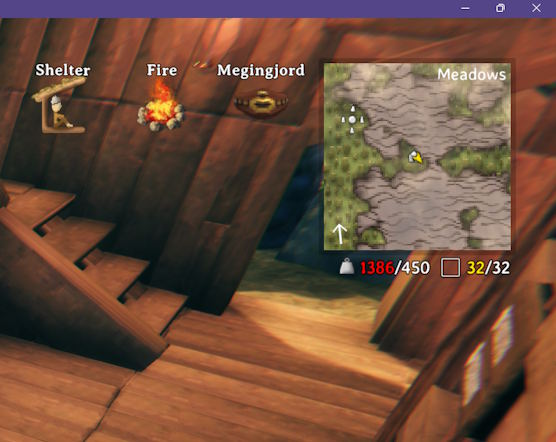

# Weight Display

Shows your current and maximum carry weight on the HUD, just below the minimap.

- Moves to the top-right corner when the minimap is hidden
- Hides along with the rest of the HUD

## Configuration

`BepInEx\config\kriona.WeightDisplay.cfg` is created on first run, and changes take effect as soon as the file is saved. You do not need to restart Valheim or rejoin the world.

| Setting | Default | Description |
| --- | --- | --- |
| FontSize | 18 | Size of the weight text |
| Margin | 6 | Gap between the minimap (or the screen corner) and the text |

## Installation

1. Install [BepInExPack for Valheim](https://www.nexusmods.com/valheim/mods/3605)
2. Extract the zip into your Valheim folder, or copy `WeightDisplay.dll` into `BepInEx\plugins`

Client-side only - other players and the server don't need it.
