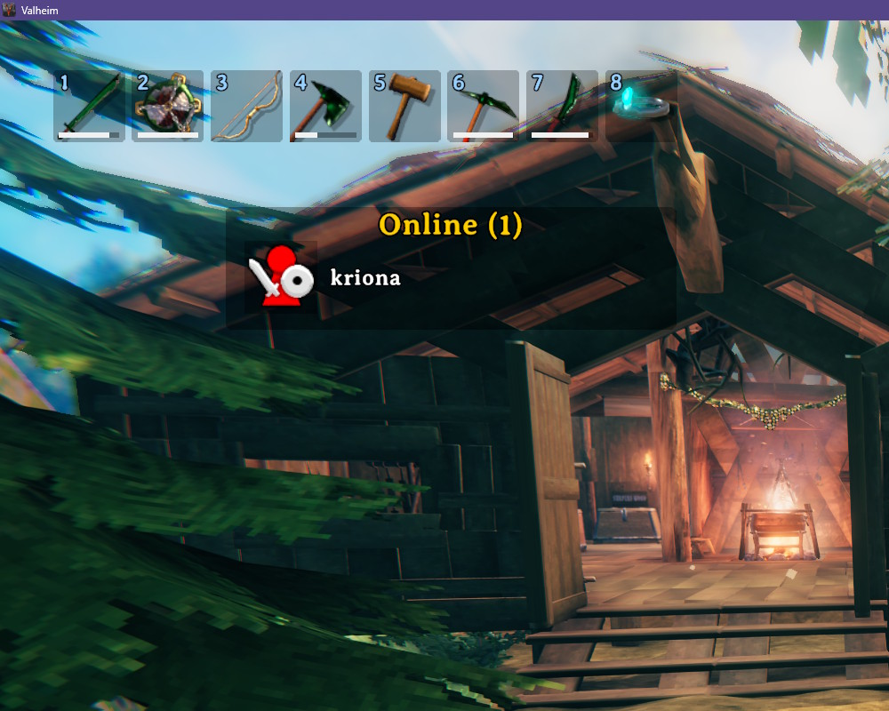
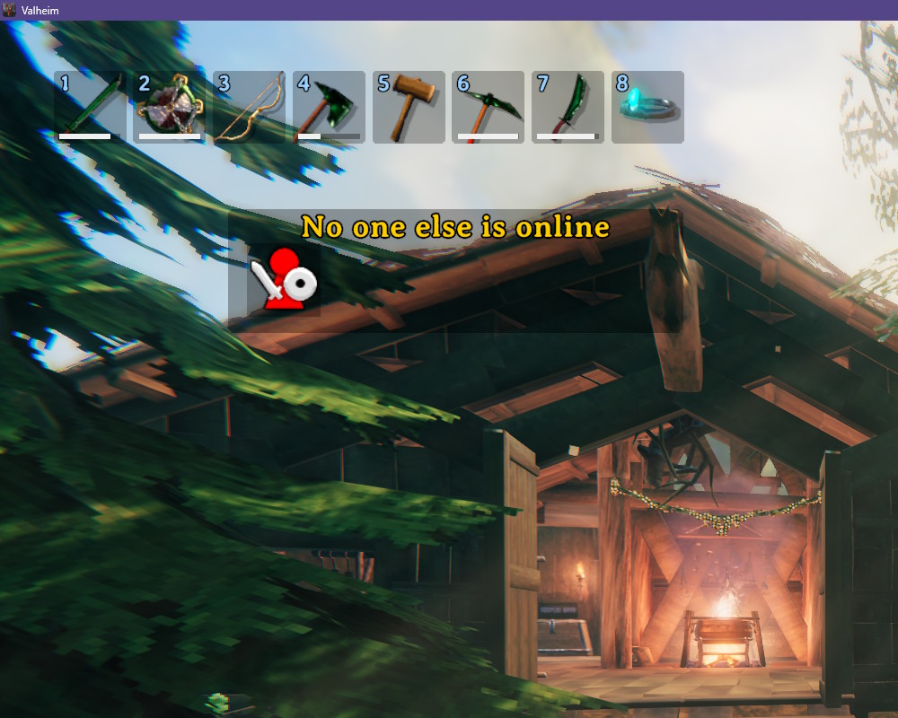

# Who's Online

Lists the other players on the server when you join, in a popup like the one for new recipes and in chat.

- Shown once per connection, the first time you spawn - not on respawns after death
- Only runs on servers hosted by someone else

## Screenshots

### When another play is online

### When no one else is online

## Installation

1. Install [BepInExPack for Valheim](https://thunderstore.io/c/valheim/p/denikson/BepInExPack_Valheim/)
2. Extract the zip into your Valheim folder, or copy `WhosOnline.dll` into `BepInEx\plugins`

Client-side only - other players and the server don't need it.
